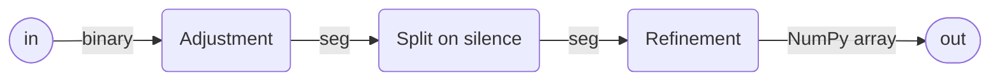

<h1> speech2text </h1>

Realtime offline (self-hosted) speech recognition tool based on [OpenAI Whisper model](https://github.com/openai/whisper).


obtained from ([this audio input](tests/audio_samples/en_chunk.wav))

<h2> Table of contents </h2> 

- [Goals](#goals)
- [Features](#features)
- [Flaws](#flaws)
- [Algorithm description](#algorithm-description)
  - [A more detailed description](#a-more-detailed-description)
  - [More about the `Preparations` stage](#more-about-the-preparations-stage)
- [How to launch](#how-to-launch)
  - [Software requirements](#software-requirements)
  - [Setting up developer environment](#setting-up-developer-environment)
  - [First run](#first-run)
- [Licensing](#licensing)

## Goals
Why did I make it:
- to get a better grasp on the modern speech-to-text instruments: their capabilities and limitations
- to reuse this project as a sub-module in my other projects

## Features
- a speech-to-text transcription, which works fully offline
  - though internet connection still required for the first launch: to download the models
- the output is very responsive: the words appear on the screen with minimal delay
- efficient usage of system resources

## Flaws
- cold start takes quite some time (20-80 sec with SSD)
- consumes a lot of RAM
  - occupies 4-8 GB with default preset (Whisper models: `tiny.en` + `small.en`)
- CUDA support is **strongly advised**:
  - works 5-10 times slower without CUDA Toolkit
  - incapable of running in real-time mode without CUDA
- may require a lot of fine-tuning at first — to adjust to your microphone
- deployment may be tricky

## Algorithm description

Audio data is stored and transformed between three different formats:
1. [WAVE PCM encoding](https://en.wikipedia.org/wiki/Pulse-code_modulation) — its implementation from Python standard library's [wave module](https://docs.python.org/3/library/wave.html)
2. [Pydub AudioSegment](http://pydub.com) — convenient for sound processing
3. NumPy array of floats — the Whisper input format

The workflow can be roughly described as follow:
1. We attempt to split the audio stream into sentences based on the pauses in speech. Each such sentence is stored in a separated **block**.
2. The last block constantly changes, because we iteratively append small chunks of sound (0.5-1.5 sec) while the uses speaks. It is referred to as **ongoing block**.
3. All the previous blocks won't be changing. They are referred to as **finalized blocks**.
4. We apply a **slow high quality transcription** to each of the finalized blocks — only once.
5. We apply a **fast low quality transcription** to the ongoing block at each iteration.

This approach is a tradeoff between quality and speed. It immediately gives the user a low quality transcription of what he says in the current phrase, and it refines this transcription when the phrase is finished.

### A more detailed description


, where:
1. `Listener` provides a stream of fixed sized PCM-encoded binary chunks.
2. `Accumulation` — adds new binary chunks to the currently ongoing audio block.
3. `Preparations` — transforms binary data into NumPy array, and applies a variety of measures in order to increase the quality of transcription.
4. `Transcribing` — applies low quality transcription to the ongoing audio block, applies high quality transcription to the blocks to be finalized (if any), sends the ongoing block back to `Accumulation`.

### More about the `Preparations` stage


1. `Adjustment`
   - transforms `binary` (WAVE PCM encoding) to `seg` (Pydub AudioSegment)
   - may apply volume normalization
2. `Split on silence` — splits audio blocks on silence
   - all except the last block are marked to be finalized
3. `Refinement`
   - may apply human voice frequency amplification
   - may speed up the audio
   - applies normalization
   - converts to `mono, 16000 Hz`
   - converts to NumPy array of floats
   - may apply noise suppression


## How to launch
### Software requirements
- [Python 3.11](https://www.python.org/downloads/)
- [Poetry](https://python-poetry.org)
- (optional) [make](https://en.wikipedia.org/wiki/Make_(software)) tool
- (optional) [CUDA Toolkit](https://developer.nvidia.com/cuda-downloads)

### Setting up developer environment
In case you use Windows, CUDA v11.4: just run `make init` (or `poetry install`).

Otherwise you may require changing the `pyproject.toml` file: the `torch` dependency from `[tool.poetry.dependencies]` section.

### First run
Before launching the app, you might want to tackle with the [workflow_debugging.ipynb](speech2text/blob/main/speech2text/experiments/workflow_debugging.ipynb) notebook.

To launch the app, run: `make run` (or `make`, or `poetry run python -m speech2text`). It will transcribe the [en_chunk.wav](tests/audio_samples/en_chunk.wav) file. The result should resemble the animation from the top of the project.

To transcribe your mic input instead: in `__main__.py` replace `demo_console_realtime(IN_FILE_PATH)` with `demo_console_realtime()`.

You also might want to have a look at [config.yaml](config.yaml) — in order to fine-tune the settings. If having troubles with performance:
- replace `model_name: small.en` with `model_name: tiny.en`
- delete all the inclusions of `noisereduce` sub-section (replace it with `noisereduce:`)
- make sure CUDA is available:
   ```python
  from torch import cuda

  assert cuda.is_available()
  ```

## Licensing

[MIT License](LICENSE)